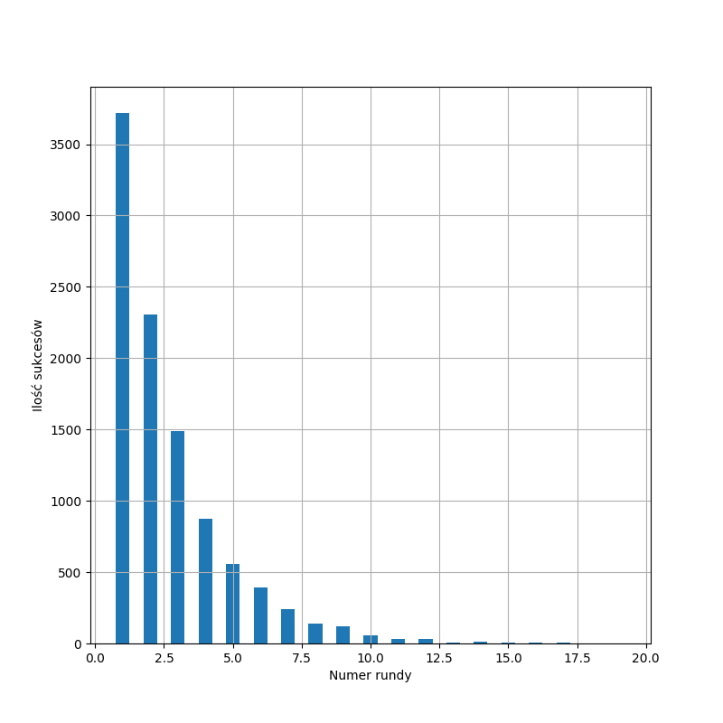
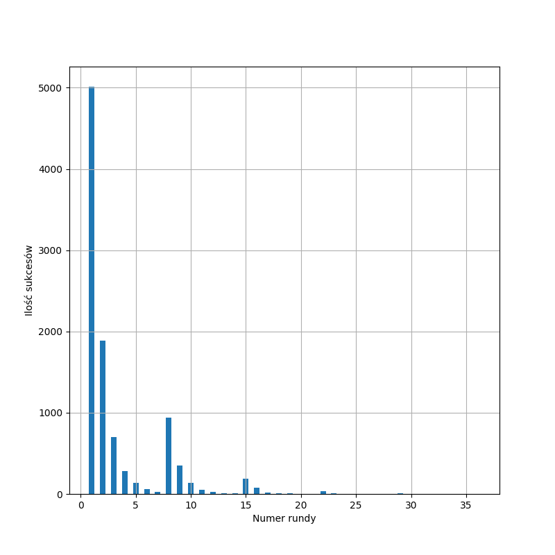
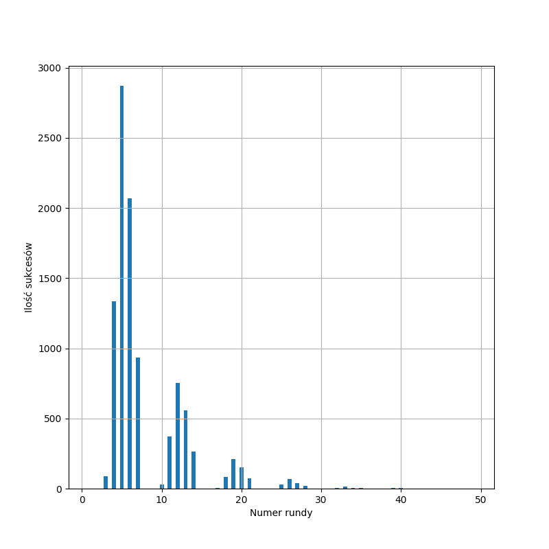
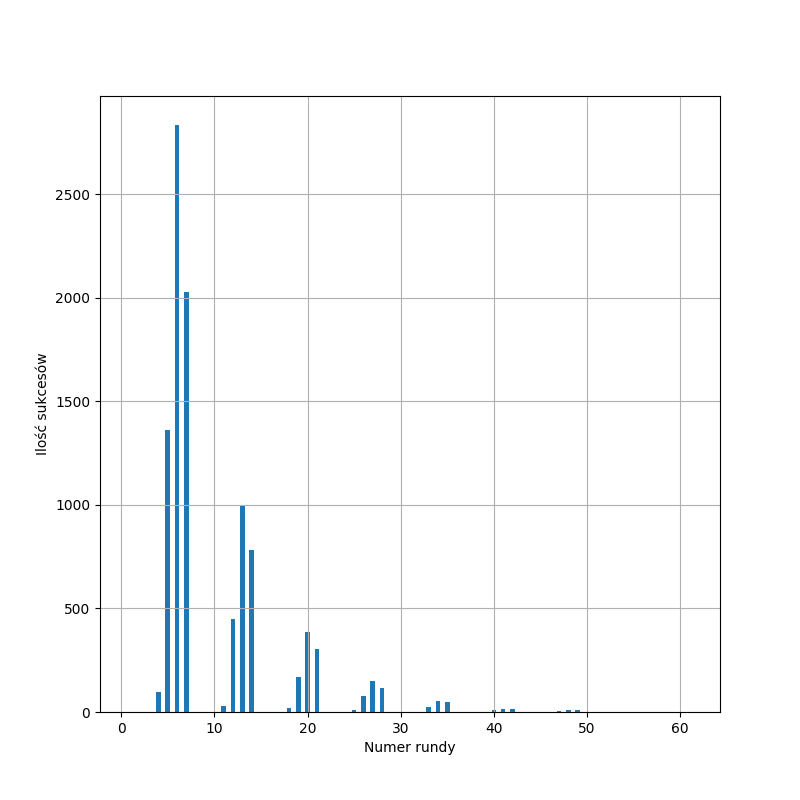
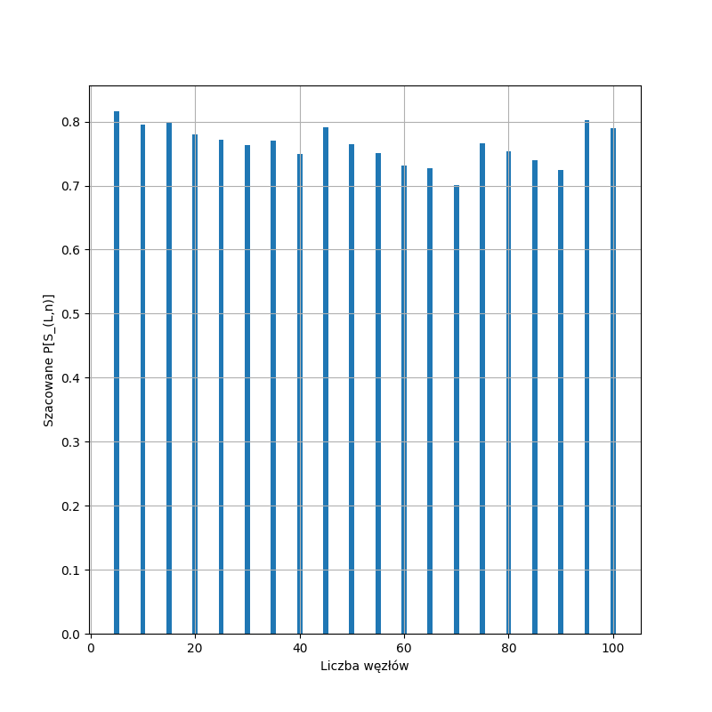

## Uruchomienie
Aby uruchomić program potrzebujemy `Pythona` w wersji 3 oraz pakietów `matplotlib` i `click`.

Uruchamiając program ustawiamy następujące parametry:
- -s : wybrany scenariusz (przyjmuje wartości `second` lub `third`)
- -n : ilość powtórzeń eksperymentu

Następnie wybieramy zadanie z listy - `zad1`, `zad2`, `zad3` lub `zad4`.

Na końcu podajemy wymagane argumenty:
- Zadanie 1 : liczbę węzłów i opcjonalnie górne ograniczenie
- Zadanie 2 : liczbę węzłów i opcjonalnie górne ograniczenie
- Zadanie 3 : liczbę węzłów
- Zadanie 4 : górne ograniczenie

Przykładowe uruchomienie dla zadania 2, scenariusza trzeciego powtórzonego 10000 razy, liczby węzłów równej 500 i ograniczenia górnego równego 3000:

> $ python3 run.py -s third -n 10000 zad2 500 3000

# Zadanie 1
Implementacja symulatora znajduje się w pliku `leader_election.py` w funkcji `leader_election`, która zwraca numer slotu w którym udało się wybrać lidera. W tym samym pliku znajduje się funckcja `leader_election_n_times`, która wywołuje symulator określoną liczbę razy. Funkcja ta jest używana w kolejnych zadaniach.

# Zadanie 2
Dla drugiego scenariusza wybieramy n=100 i uruchamiamy symulator 10000 razy. Wynik:

Dla trzeciego scenariusza wybieramy u=100 i uruchamiamy symulator 10000 razy dla przypadków:

- n = 2:

- n = u/2:

- n = u:

W przypadku scenariusza 3 możemy wyróżnić w każdej rundzie sloty, w których lider jest najczęściej wybierany. Są to sloty, w których prawdopodobieństwo nadawania dla każdego z węzłów jest zbliżone do $\frac{1}{n}$, gdzie $n$ jest liczbą węzłów.

# Zadanie 3
Wybierzmy n=100.

Wartość oczekiwaną obliczamy ze wrozu: 
$$\mathbb{E}(X) = \sum_{i=1}^{k}x_ip_i$$
, gdzie $x_i$ jest numerem slotu, w którym wybrano lidera, a $p_i$ prawdopodobieństwem tego, że w $x_i$-tym slocie wybrano lidera. $p_i$ będziemy obliczać na podstawie określonej liczby uruchomień symulatora.

Wartość oczekiwana dla 10000 prób: 2.708799999999999

Wariancję obliczamy ze wzoru:
$$\sigma^2 = \frac{1}{k} \sum_{i=1}^{k}(x_i - \overline{x})^2$$
, gdzie dla $k$ powtórzeń eksperymentu $\overline{x}$ jest oszacowaną wartością oczekiwaną, a $x_i$ wynikiem $i$-tego eksperymentu.

Wariancja dla 10000 prób: 4.707602559999803

Uzyskane wyniki pokrywają się z wynikami teoretycznymi.

# Zadanie 4
W zaproponowanym doświadczeniu ustalamy wartość ograniczenia górnego $u$, a następnie schodzimy z ilością węzłów od $n=u$ do $n=2$. Dla każdego n uruchamiamy symulator określoną liczbę razy i na podstawie otrzymanych wyników szacujemy wartość $Pr[S_{L,n}]$. Następnie dla wyliczonych wartości sprawdzamy warunek $Pr[S_{L,n}] \geq \lambda$.
Wynik jest wypisywany na wyjściu. Dodatkowo rysowany jest histogram przedstawiający wartość $Pr[S_{L,n}]$ dla kolejnych $n$.

Wybrano $u=100$ i dla każdego n uruchomiono symulator 10000 razy.
Doświadczenie zakończyło się sukcesem.
Wykres:

Eksperyment powtórzono dla u=20, u=200 oraz u=1000. W każdym przypadku wynik był poprawny.
