# Informacje

 - Implementacja algorytmu **MinCount** znajduje się w pliku `min_count.py`.
 - Implementacja algorytmu **HyperLogLog** znajduje się w pliku `hyper_log_log.py`.
 - Plik `hash_functions.py` zawiera implementacje użytych w testach funkcji haszujących.
 - W pliku `utils.py` znajdują się funkcje pomocnicze używane do rozwiązania zadań z listy - głównie rysujące wykresy.

# Zadanie 5

 - **a)** Obecność powtórzeń nie powinna mieć wpływu na warotość $\hat{n}$, jeśli używana funkcja haszująca spełnia warunek mówiący o tym, że funkcja haszująca zawsze powinna zwracać tą samą wartość dla tego smego argumentu. 

 - **b)** Wykres dla zbioru składającego się z losowych wartości z zakresu $[0, 2^{32})$:
    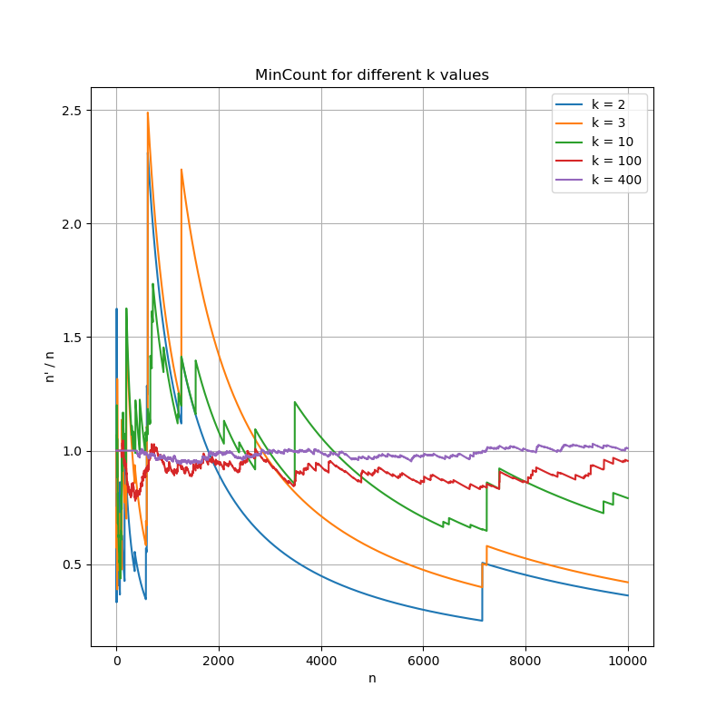
    dla k = 2:
    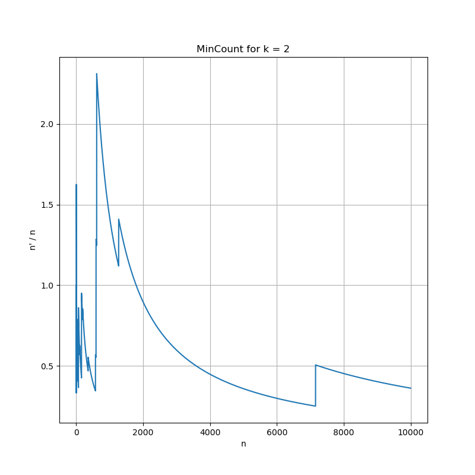
    dla k = 3:
    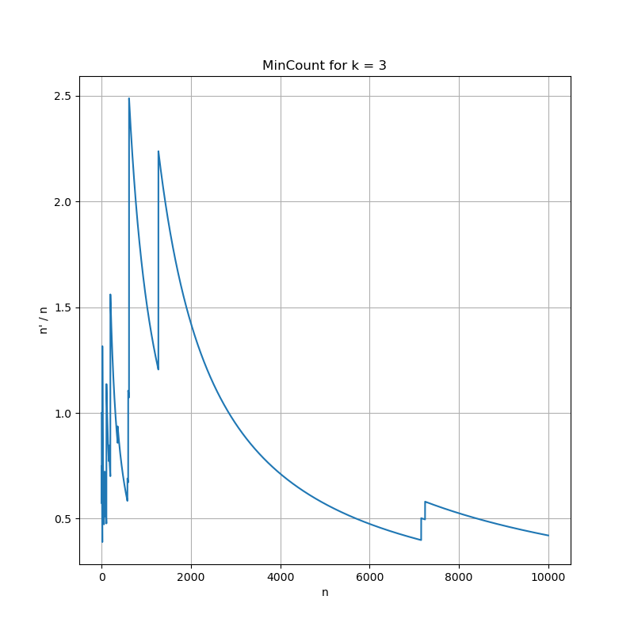
    dla k = 10:
    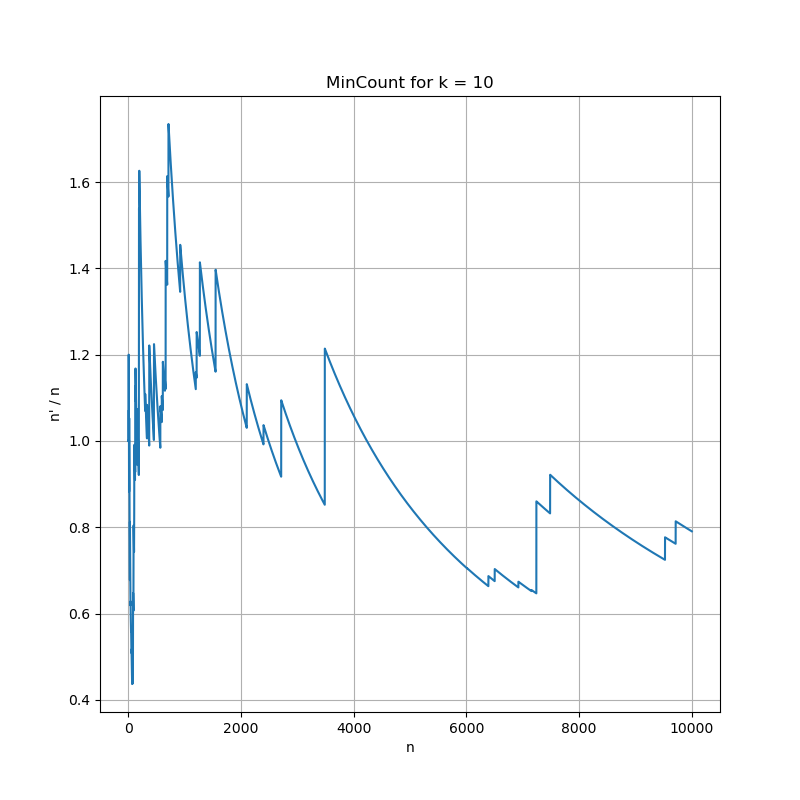
    dla k = 100:
    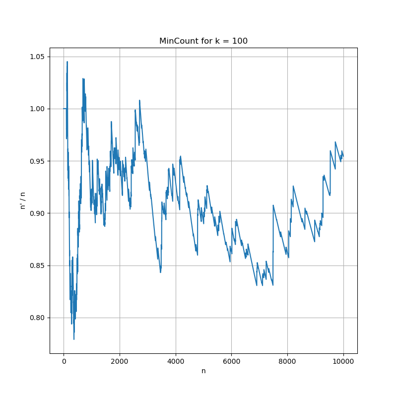
    dla k = 400:
    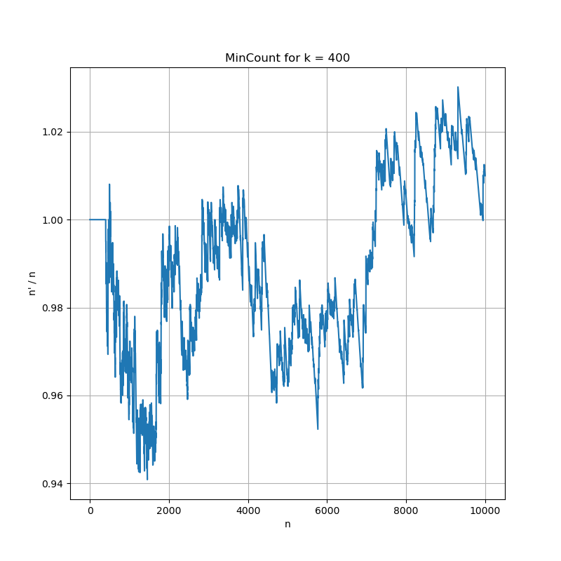

 - **c)** Przeprowadzono testy dla różnych wartości $k$ (wykres poniżej) i zauważono, że w okolicach $k = 200$ wynik osiągnął wystarczająco bliski dokładnemu wynik w 95% przypadków. Dla $k = 250$ i większych estymowana wartość była wystarczająco dokładna dla 100% przypadków (testy na zbiorach o liczności od 1 do 10000 elementów).
  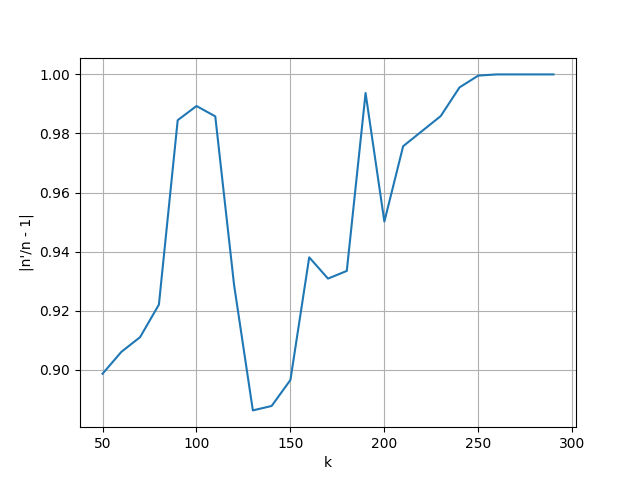
  Wykres pokazuje ile 

# Zadanie 6

Przetestowano działanie algorytmu **MinCount** dla różnych funkcji haszujących, ich definicje znajdują się w pliku `hash_functions.py`. Algorytm zwraca dobre rezultaty dla funkcji, które:
 - są odporne na kolizje, tzn. jest małe prawdopodobieństwo, że dla kilku różnych wartości $x$ wartość $h(x)$ będzie taka sama.
 - równomiernie "wypełniają" zbiór wartości funkcji - chcemy, żeby zbiór $\{h(x_1), h(x_2), \dots, h(x_n)\}$ wyglądał jak zbiór losowych wartości.

Przykładowe funkcje, dla których rezultaty były widocznie gorsze(testowano dla 32-bitowych $x$):
 - $h_1(x) = <x_1, x_2, \dots, x_{10}>_2$ # (bierzemy 10 najbardziej znaczących bitów $x$)
 - $h_2(x) = x \mod(2^{16})$

Obie z tych funkcji nie były odporne na kolizje, dla wartości $x \in [0, 2^{32})$

Porównanie wyników dla "dobrej" funkcji i określonej wyżej $h_1$:
  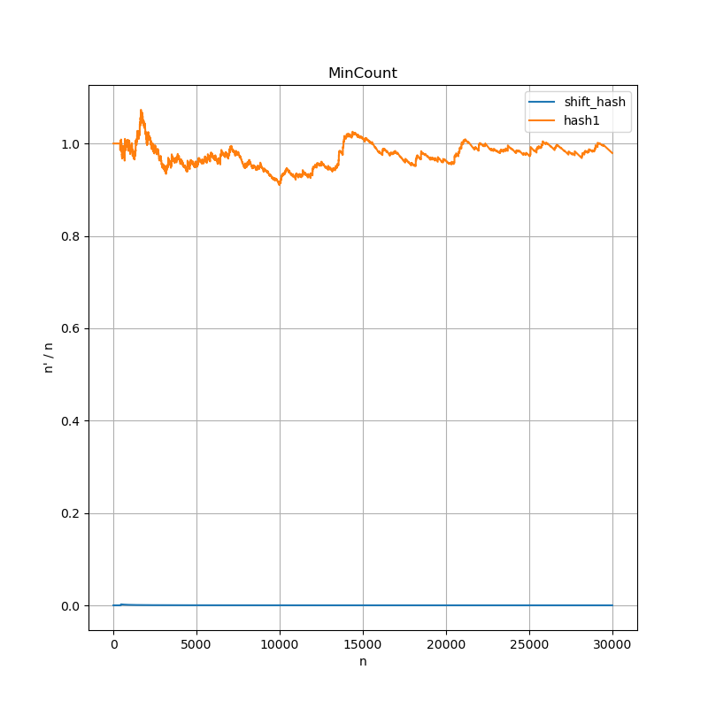

# Zadanie 7

Wykresy dla różnych wartości $\alpha$ i nierówności Czebyszewa:

 - $\alpha = 0.5\%$
  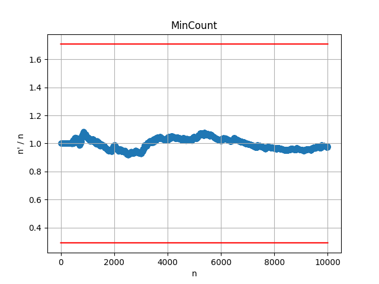
 - $\alpha = 1\%$
  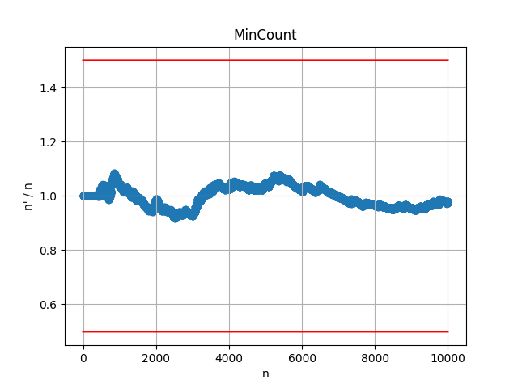
 - $\alpha = 5\%$
  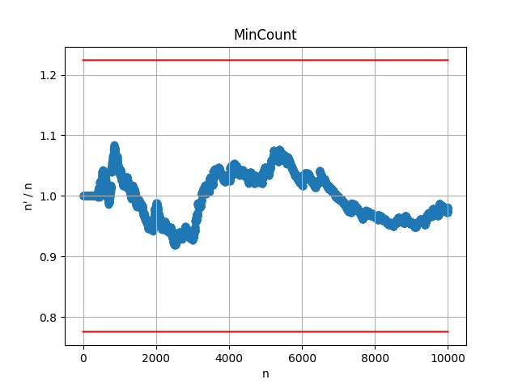

Wykresy dla różnych wartości $\alpha$ i nierówności Chernoffa:

  - TODO

# Zadanie 8

Implementacja algorytmu **HyperLogLog** znajduje się w pliku `hyper_log_log.py`.

Definicje funkcji haszujących wykorzystanych w testach znajdują się w pliku `hash_functions.py` i mają w nazwie prefiks "hyper".

Prezentacja wyników dla różnych wartości parametru $m$:
  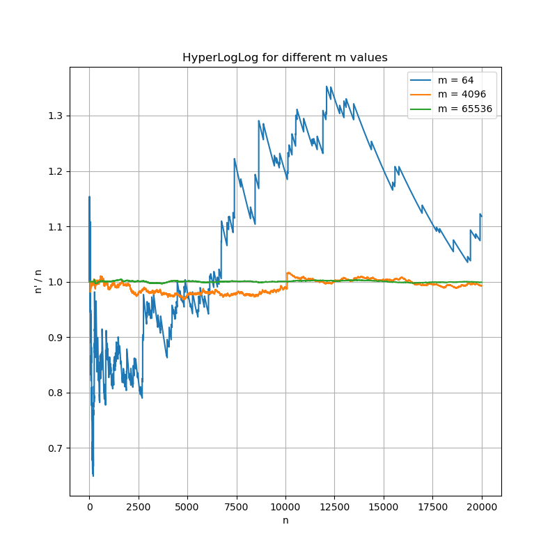
$m = 2^{6}$:
  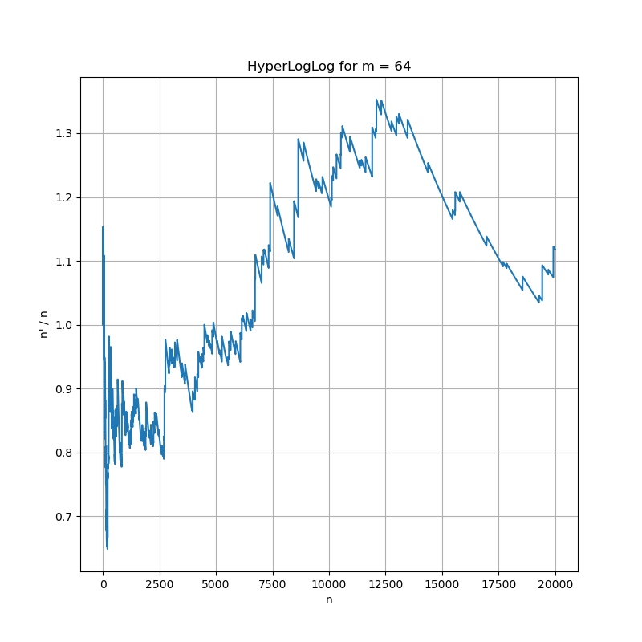
$m = 2^{12}$:
  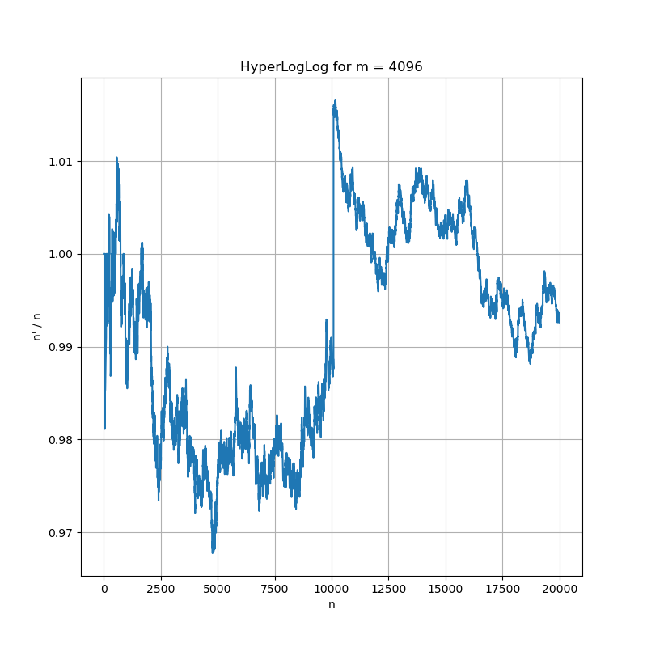
$m = 2^{16}$:
  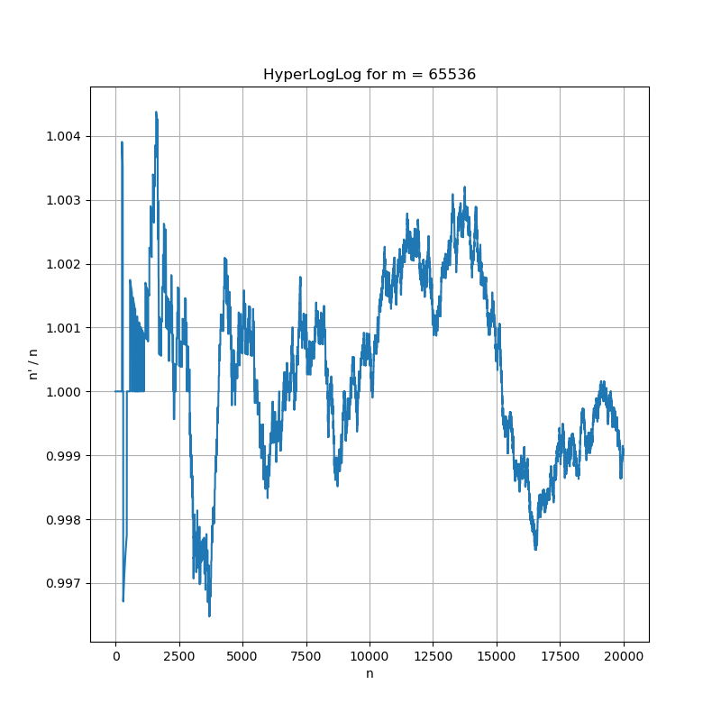

Porównanie algorytmów HyperLogLog i MinCount dla podobnej ilości używanej pamięci. 
Zakładamy, że rejestr zajmuje 5 bitów, a pojedynczy hash 32 bity.

 - ~80 bitów pamięci:
  
 
 - ~320 bitów pamięci:
  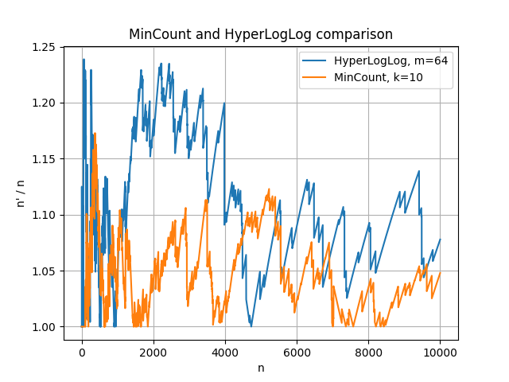
 
 - ~10240 bitów pamięci:
  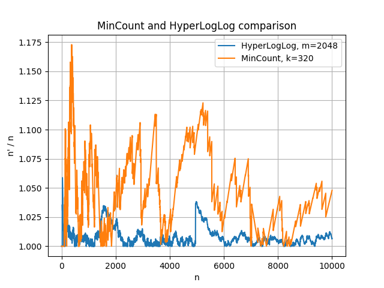

 - ~327680 bitów pamięci:
  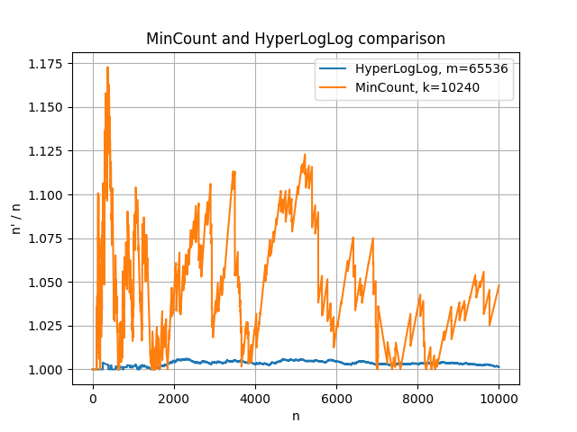

Można zauważyć, że HyperLogLog radzi sobie trochę gorzej niż MinCount w momencie kiedy ma do dyspozycji bardzo mało pamięci. Widzimy też że poprawa dokładności wraz ze wzrostem używanej pamięci jest dużo większa w przypadku HyperLogLog niż w przypadku MinCount. Już dla 320 bitów HyperLogLog przybliża $n$ z błędem podobnym do MinCount, a kiedy ilość pamięci jest większa radzi sobie znacznie lepiej.
