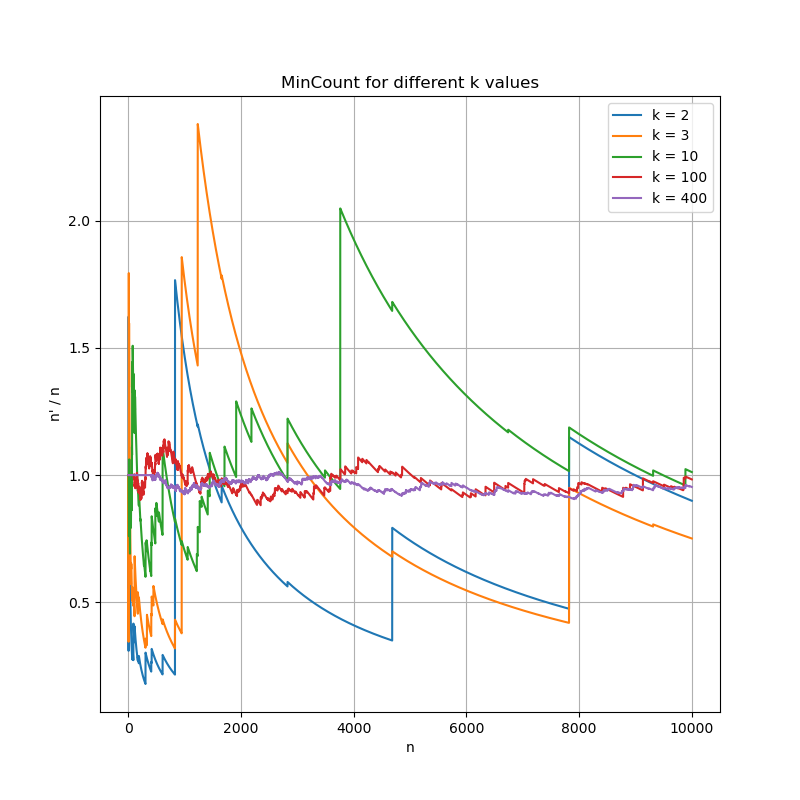
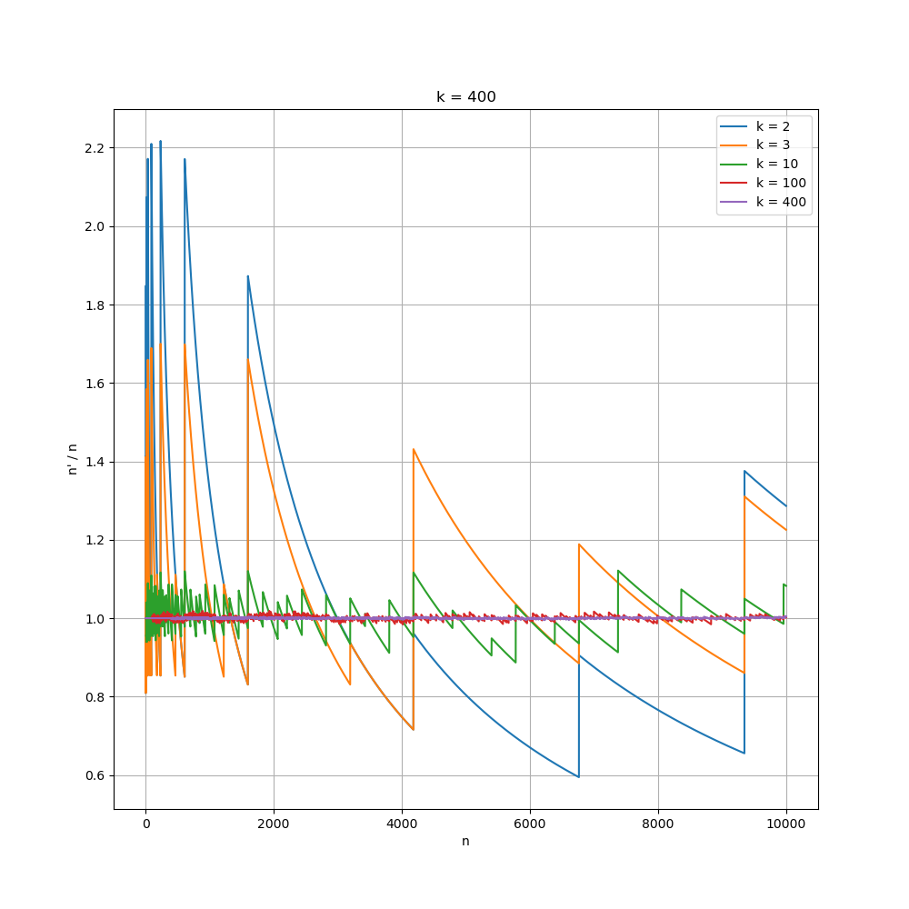

# Zadanie 5

 - **a)** Obecność powtórzeń nie ma wpływu na warotość $\hat{n}$.
 - **b)** 
    
    

 - **c)** TODO

# Zadanie 6

Przetestowano działanie algorytmu **MinCount** dla następujących funkcji haszujących:

 - multiplicative hash
 - fibonacci hash
 - modulo hash
 - random hash
(Definicje funkcji znajdują się w pliku `hash_functions.py`)

# Zadanie 7

# Zadanie 8

